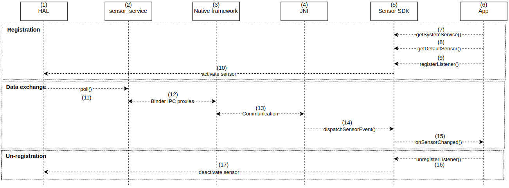
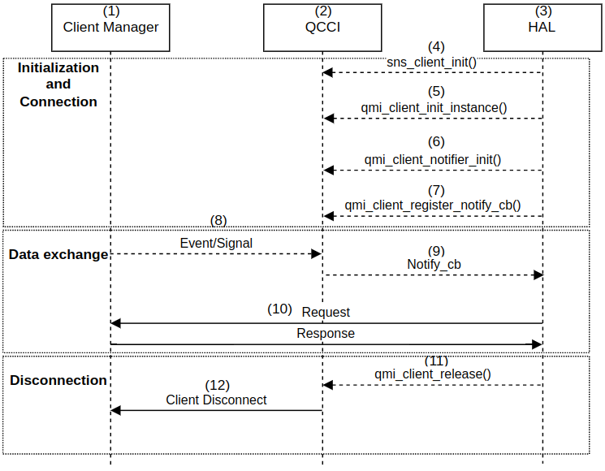
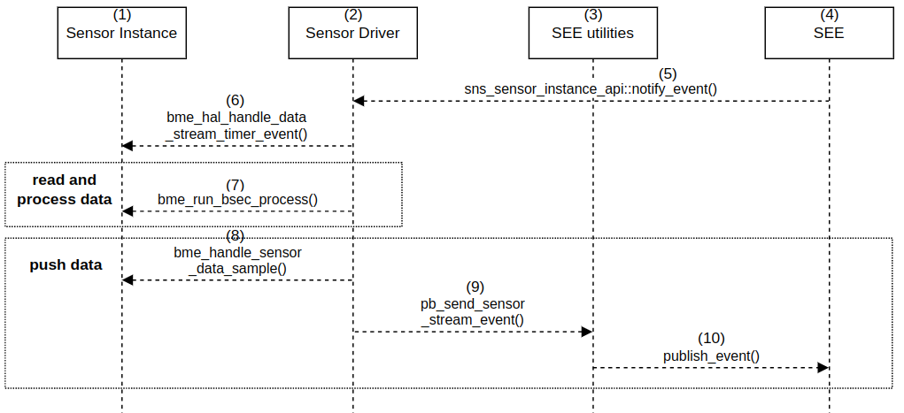
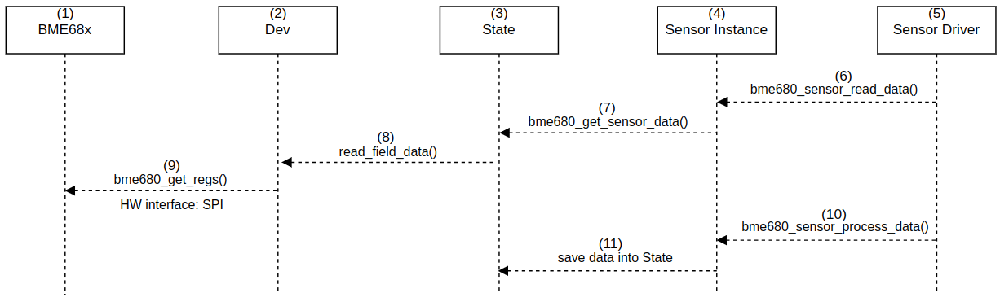

# Luồng dữ liệu
Hình bên dưới thể hiện các phân lớp liên quan đến luồng dữ liệu của cảm biến trên Android. Mỗi thành phần chỉ giao tiếp với các thành phần trực tiếp bên trên và bên dưới nó, một số cảm biến có thể bỏ qua trung tâm cảm biến (sensors hub).


## I. Biểu đồ luồng dữ liệu
Các luồng điều khiển từ ứng dụng xuống cảm biến và các luồng dữ liệu từ cảm biến lên ứng dụng được trình bày chi tiết bên dưới.

### Tổng quan
Xét luồng dữ liệu từ dưới cảm biến khi cảm biến thu thập và đẩy dữ liệu lên qua các tầng đến lớp ứng dụng.

Luồng dữ liệu chính như sau:


| STT | Mô tả |
|-------|-------|
| 1 | Thiết bị cảm biến vật lý trên thiết bị thực hiện thu thập các thông số trạng thái của môi trường, tạo thành các mẫu dữ liệu, và lưu trữ trong bộ nhớ. |
| 2 | Trình điều khiển có nhiệm vụ quản lý cảm biến và cung cấp giao diện chuẩn cho các phần mềm bậc cao để truy xuất dữ liệu từ cảm biến. Trình điều khiển cảm biến được triển khai ở SEE. |
| 3 | Sensors Execution Environment - SEE</br> Khối quản lý cảm biến được triển khai bởi Qualcomm trên *ADSP* (Application Digital Signal Processor), cung cấp các giao diện, *API* (Application Programming Interface) hướng sự kiện đơn giản, để thao tác với cảm biến. |
| 4 | Hardware Abstraction Layer - HAL</br>Lớp HAL trong Android quản lý các cảm biến và sự kiện của chúng. Cho phép các ứng dụng lớp trên thao tác với phần cứng khả dụng thông giao diện chuẩn.|
| 5 | Lớp ứng dụng trong Android sử dụng dữ liệu của cảm biến để hiện thị lên giao diện người dùng và thực hiện các tác vụ xử lý tính toán khác. |
| 6 | Quá trình đọc dữ liệu từ cảm biến vật lý và thực hiện xử lý. Trình điều khiển truyền thông với cảm biến bằng các chuẩn giao tiếp phần cứng như SPI, I2C.|
| 7 | Quá trình đẩy dữ liệu lên thông qua sensor API, được triển khai bởi nhà sản xuất, cho phép SEE thao tác với cảm biến. Cụ thể, khi có sự thay đổi dữ liệu từ cảm biến, SEE sẽ gọi hàm ```notify_event()``` để cập nhật dữ liệu.|
| 8 | Quá trình truyền dữ liệu từ SEE cho các máy khách (client) khác thông qua client API. Với hệ thống thiết kế, client là HAL.  HAL sử dụng giao diện bản tin (Qualcomm Messaging Interface - QMI) từ client API để truyền thông với SEE.|
| 9 | Quá trình truy xuất dữ liệu của lớp ứng dụng sử dụng các *framework API* của Android.|
### Chi tiết
Các tương tác truyền thông chi tiết được trình bày dưới đây.
#### HAL và App
Phần này trình bày các thủ tục đăng kí, hủy đăng kí dịch vụ cảm biến và quá trình truyền thông trao đổi dữ liệu giữa HAL và App, cùng với các thành phần có liên quan.



| STT | Mô tả |
|-------|-------|
| 1 | Lớp HAL cung cấp các giao diện chuẩn giữa trình điều khiển cảm biến (sensor driver) và *Android framework**. HAL cung cấp các API cho phép Android framework kích hoạt và truy xuất cảm biến. |
| * | Android framework</br>Chịu trách nhiệm liên kết ứng dụng với HAL. Mã nguồn của *Android framework* được xác định ở thư mục ```AOSP_source/framework```. |
| 2 | Sensor service</br>Trình cung cấp dịch vụ liên quan đến cảm biến. Nằm trong Android framework, được xác định ở ```/frameworks/native/services/sensorservice```. |
| 3 | Native framework</br>Mã nguồn gốc bậc thấp nằm trong Android framework, được xác định trong ```frameworks/native/```. Cung cấp một mô hình tương đương với gói *android.hardware* |
| 4 | Java Native Interface - JNI</br>JNI là một framework lập trình cho phép mã nguồn Java chạy trong Máy ảo Java (Java Virtual Machine - JVM) gọi và được gọi bởi các ứng dụng và thư viện gốc được viết bằng các ngôn ngữ khác như C/C++. JNI cho cảm biến được xác định ở ```frameworks/base/core/jni/android_hardware_SensorManager.cpp``` |
| 5 | Sensors Software Development Kit - Sensor SDK</br>Cung cấp một tập các API cho phép các ứng dụng đăng kí và truy cập vào cảm biến. |
| 6 | Ứng dụng có sử dụng dữ liệu của cảm biến |
| 7 | Hàm truy xuất đến trình điều khiển cảm biến (Sensor Manager), cung cấp bởi Sensor SDK |
| 8 | Hàm truy xuất đến cảm biến mặc định theo kiểu cho trước, cung cấp bởi Sensor SDK |
| 9 | Hàm đăng kí trình lắng nghe sự kiện (Listener), cung cấp bởi Sensor SDK.</br> Listener có nhiệm vụ thông báo cho ứng dụng biết có sự kiện thay đổỉ dữ liệu. |
| 10 | Android framework gửi yêu cầu tới HAL để kích hoạt cảm biến. |
| 11 | Các HAL API được gọi bởi các dịch vụ cảm biến.</br> Hàm *poll* trả về các sự kiện kèm dữ liệu.  |
| 12 | Binder IPC proxies</br>Một cơ chế cho phép các tiến trình khác nhau giao tiếp với nhau.</br>Native framework gọi các Binder IPC proxy để có quyền truy cập vào các dịch vụ dành riêng cho cảm biến. |
| 13 | JNI gọi tới mã nguồn trong Native framework để thao tác với phần cứng cảm biến.  |
| 14 | Hàm được gọi bởi JNI khi có dữ liệu mới, cung cấp bởi Sensor SDK. |
| 15 | Hàm được triển khai trên ứng dụng, để giám sát sự thay đổi dữ liệu. |
| 16 | Hàm hủy đăng kí Listener, cung cấp bởi Sensor SDK. |
| 17 | Android framework gửi yêu cầu tới HAL để hủy kích hoạt cảm biến. |
#### SEE và HAL
Phần này trình bày các thủ tục khởi tạo/hủy kết nối từ SEE tới client (cụ thể là HAL) và quá trình trao đổi dữ liệu giữa chúng, cùng với các thành phần có liên quan.


| STT | Mô tả |
|-------|-------|
| 1 | Client Manager</br>Khối chức năng thuộc SEE, thực hiện quản lý các đối tác truyền thông với SEE|
| 2 | Qualcomm Messaging Interface - QMI</br>Một giao thức được sử dụng để truyền thông giữa SEE và tất cả đối tác chạy trên các bộ xử lý.<br>QMI Common Client Interface - QCCI</br>Một framework cung cấp các API thống nhất mà hỗ trợ giao thức QMI. |
| 3 | Lớp HAL quản lý các mô đun phần cứng liên quan đến cảm biến |
| 4 | API cho phép tạo *client*, đại diện cho đối tác của SEE |
| 5 | API cho phép mở kết nối tới dịch vụ cảm biến |
| 6 | API cho phép tạo trình xử lý thông báo (notifier) và đăng kí hàm gọi (callback) cho dịch vụ cảm biến |
| 7 | API cho phép đăng kí callback cho dịch vụ cảm biến. Khi có dịch vụ của cảm biến thì callback sẽ được gọi để thông báo cho HAL biết. |
| 8 | Khi có dữ liệu đẩy lên từ SEE thông qua sự kiện, tạo dịch vụ cảm biến|
| 9 | Gọi callback để thông báo cho HAL |
| 10 | Quá trình hỏi đáp giữa HAL và SEE thông qua Client Manager. |
| 11 | API thực hiện giải phóng kết nối tới SEE |
| 12 | Hủy bỏ kết nối giữa SEE và đối tác HAL |
#### Sensor Driver và SEE
Phần này trình bày quá trình truyền thông giữa các thành phần trong SEE, bao gồm đọc dữ liệu và đẩy dữ liệu lên.


| STT | Mô tả |
|-------|-------|
| 1 | Sensor Instance</br>Đại diện cho cảm biến BME68x khi hoạt động ở chế độ và cấu hình cụ thể |
| 2 | Sensor Driver</br>Trình điều khiển cảm biến |
| 3 | Khối chức năng cung cấp các tiện ích của SEE |
| 4 | Khối quản lý cảm biến|
| 5 | SEE gọi API này để thông báo cho Sensor Instance biết có sự kiện thay đổi dữ liệu ở cảm biết. Đồng thời, nó cũng thông báo cho client biết có dữ liệu được nhận. |
| 6 | Hàm cho phép cảm biến thiết đặt chế độ làm việc để đọc, xử lý và đẩy dữ liệu lên|
| 7 | Hàm chính thực hiện đọc và xử lý dữ liệu|
| 8 | Hàm hiệu chuẩn mẫu dữ liệu|
| 9 | Hàm thực hiện khởi tạo, gán và mã hóa dữ liệu theo sự kiện|
| 10 | Hàm đẩy dữ liệu lên cho các đối tượng đã đăng kí thông qua sự kiện|

#### BME68x và Sensor Driver
Phần này trình bày quá trình truyền thông giữa các thành phần trong Sensor Driver, liên quan đến việc đọc dữ liệu từ thanh ghi và tiền xử lý dữ liệu đó.



| STT | Mô tả |
|-------|-------|
| 1 | BME68x</br>Cảm biến vật lý thu thập và lưu trữ dữ liệu vào bộ nhớ |
| 2 | dev</br>Cấu trúc dữ liệu chứa thông tin của cảm biến |
| 3 | state</br>Trạng thái của Sensor Instance, lưu trữ thông tin về từng mẫu dữ liệu |
| 4 | Sensor Instance</br>Đại diện cho cảm biến BME68x khi hoạt động ở chế độ và cấu hình cụ thể |
| 5 | Sensor Driver</br>Trình điều khiển cảm biến |
| 6 | Hàm đọc dữ liệu |
| 7 | Hàm thực hiện kiểm tra thông tin cảm biến và đọc dữ liệu|
| 8 | Hàm thực hiện đọc dữ liệu thô từ bộ nhớ cảm biến, tính toán bù dữ liệu và lưu trữ nó  |
| 9 | Hàm trực tiếp đọc dữ liệu từ thanh ghi dựa trên địa chỉ thông qua giao tiếp phần cứng SPI |
| 10 | Hàm thực hiện gán dữ liệu cho *state* dựa trên loại dữ liệu. <br>Có 4 loại dữ liệu được định nghĩa bởi nhà sản xuất, bao gồm:<br>- BME68x_TEMPERATURE<br>- BME68x_HUMIDITY<br>- BME68x_PRESSURE<br>- BME68x_GAS<br>Các loại dữ liệu này dùng để xác định kiểu cảm biến trong **Sensor Manager** ở trên. |
| 11 | Hàm thực hiện lưu dữ liệu vào file trên điện thoại, nằm trong bộ nhớ cố định. Đường dẫn file ```/mnt/vendor/persist/sensors/iaqdata.json```|


## II. Hiện tại
Dữ liệu được hiệu chỉnh bởi Sensor Instance trong trình điều khiển, và nhận trên ứng dụng thông qua **Sensor Manager** ,bao gồm:
- Temp - Nhiệt độ
- Humi - Độ ẩm
- IAQ average- Chất lượng không khí trung bình hiện tại
- IAQ - Chất lượng không khí
### Đối với IAQ average
Ngoài việc đẩy lên theo luồng dữ liệu, thông số IAQ average được trình điều khiển cảm biến lưu vào một vùng nhớ dữ liệu cố định, tồn tại qua các lần khởi động lại. Thể hiện dưới dạng file JSON, có đường dẫn ```/mnt/vendor/persist/sensors/iaqdata.json``` trong điện thoại.

Cách đọc file như sau:
1. Kết nối máy tính với điện thoại thông qua dây USB
2. Mở Terminal trên máy tính. 
Gõ lệnh:
```C
adb shell
cat /mnt/vendor/persist/sensors/iaqdata.json
```
### Đối với Temp, Humi và IAQ
Các thông số này được đẩy lên theo luồng dữ liệu được trình bày như trên.
## III. Hướng đề xuất
Dữ liệu mong muốn thu được bao gồm:
- Temp - Nhiệt độ
- Humi - Độ ẩm
- Press - Áp suất
- Gas_res - Trở kháng khí <br/>

Các dữ liệu được lưu vào file và có thể được truy xuất bởi mô hình AI để thực hiện chức năng phân biệt mùi.
